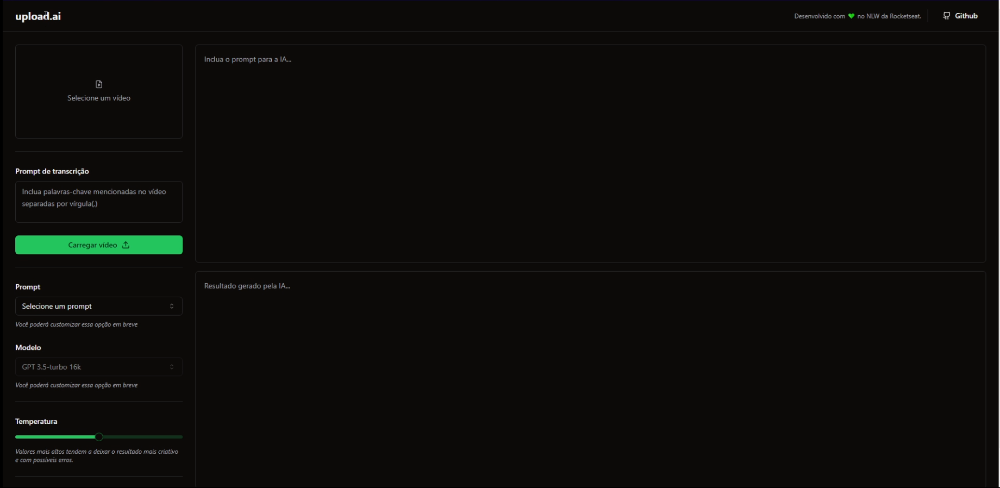

# Upload.ai - Front End

upload.ai is an automated video transcription and text generation platform based on advanced AI models. With this tool, you can upload your videos and get accurate transcriptions, as well as automatically create titles and descriptions based on the video content. We simplify the process of creating text-rich content, saving you time and effort.

## ✨ Live Preview

You can access the live preview clicking [here]().

## Preview



## 🚀 How can I set up the frontend?

First of all, clone the project in your computer.

```bash
  git clone git@github.com:gustavogarciac/uploadai.git
```

---

### 💫 Running the frontend

```bash
  // Install necessary dependencies
  $ npm install

  //Run the server
  $ npm run dev

  // The terminal will show you the write url to acess the server, otherwise you can acess
  // http://localhost:5173/

```

## 🚀 Technologies

- ReactJS
- TypeScript
- Web Assembly
- TailwindCSS
- Vite
- Axios
- OpenAI API
- ShadCN
- Radix

## 💻 Copywright

Feel free to use this material to your own projects.
